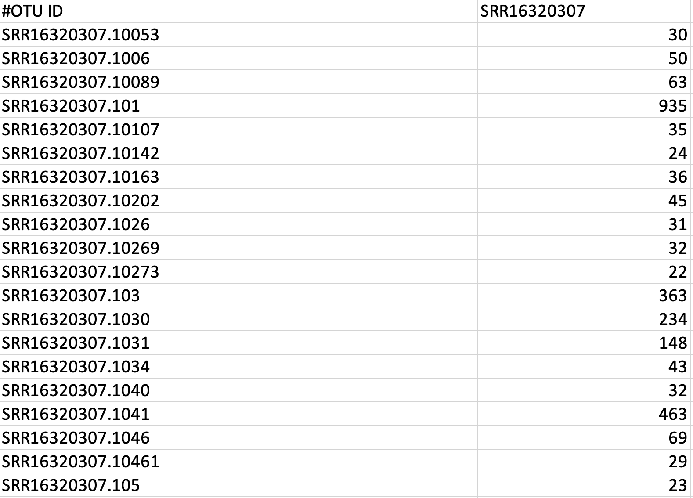

# ASV Count Table Workflow: Generating Insights from Amplicon Sequencing

### *By Anika Nag*

---------------------

## Repository Contents 

### Directories

  + `raw_fastq`: Contains raw FASTQ files used as input for the workflow. 

  + `images`: Includes images referenced in README.md. 

  + `results`: Generated from the pipeline and contains all the outputs, including intermediate and final results. 
        
  + `work`: Generated from the pipeline and stores intermediate files created during Nextflow execution. 
  
  
### Files

  + `ASVs_main.nf`: The main Nextflow script for the ASV workflow, defining the processes and workflow.
  
  + `nextflow.config`: Configuration file for Nextflow that sets up parameters and Docker containers and settings.
  
  + `README.md`: This file, providing an overview of the ASV count table workflow and usage instructions.
  
  + `.gitignore`: Specifies files and directories to exclude from version control. 

---------------------

## Project

This Nextflow workflow processes raw paired-end FASTQ files and generates an Amplicon Sequenxe Variant (ASV) count matrix. In addition, it also generates many intermediate QC files. The workflow automates steps such as quality control, merging, filtering, dereplication, chimera removal and creation of ASV count matrix. This output is ideal for various downstream microbial ecology analyses, such as ASV-species diversity matrix. 

--------------------

## Overview

Analyzing the microbial diversity of host-associated and free living microorganims in humans, other animals and environments such as water and soil provides key insight for improving human health and agriculture [1]. Sequencing a specific gene, such as a hypervariable region of the bacterial 16s rRNA gene using PCR to create amplicons (targeted amplicon sequencing) is one of the most popular ways of bacterial diversity analysis [2]. 

The downstream analysis of amplicon data typically involves aggregation of paired reads into sequences and grouping them into clusters based on sequence identity thresholds (~97%).These clusters are termed as operational taxonomic units (OTUs) [3]. However, recent microbial ecology studies show an inclination for denoising methods, producing exact sequence variants, known as amplicon sequence variants (ASVs), instead of generating clusters [4].

Amplicon sequence variant methods work by  assesing the quality of the sequencing run and generating an error model. This model makes comparisons between "true" biological variation and variations that were likely caused by sequencing errors [5]. Finally, the "true" sequences that vary from as little as a single base are identified and defined as ASVs, providing greater accuracy than with OTUs [2].

Before any downstream analyses, quality control must be performed on raw FASTQ files to obtain clean data. fastp is an ultra-fast FASTQ preprocessor which performs quality control, adapter trimmin and quality filtering steps with just one scan of the FASTQ data [6]. 

VSEARCH is a comprehensive and versatile tool that includes most commands needed for microbial ecology analyses for metagenomic, genomic and population genomics sequence data. It can perform functions such as clustering by similarity, chimera detection, dereplication, filtering and merging of paired end reads [7]. 

This workflow implements steps to generate an ASV count matrix using tools such as `fastp` and `vsearch`. It processes raw FASTQ files into a format ready for ecological and statistical analysis.

## Input Data

This workflow can process raw 16s rRNA FASTQ data. As an example, we provide paired end sequencing data from the sudy titled, 'Study: Evaluation of changes to the oral microbiome based on S16 rRNA sequencing among children treated for cancer'. Here is the SRA accession number: SRR16320307. This data is located in the raw_fastq directory.

## Workflow Summary

This workflow includes the following steps:

1. **Quality Control**: Reads are trimmed to remove low-quality sequences and adapters(`fastp`).
2. **Read Merging**: Paired-end reads are merged into single reads (`vsearch`).
3. **Filtering**: Reads are filtered based on length and quality (`vsearch`).
4. **Concatenation**: Filtered reads are concatenated into a single file for dereplication.
5. **Dereplication**: Unique sequences are identified and their abundances are recorded.
6. **ASV Denoising**: Noise is reduced and ASVs are identified. 
7. **Chimera Removal**: Chimeric sequences are identified and removed.
8. **Singleton Removal**: Low-abundance sequences (singletons) are removed.
9. **Count Matrix Generation**: Reads are mapped back to ASVs to create the count matrix.

Here is a visualization of the workflow:


---------------------

## Dependencies

Installing and running this workflow requires the following tools:
- Nextflow (version 24.10.1 or higher) - [Click here to install](https://www.nextflow.io/docs/latest/install.html)
- Docker (version 27.3.1 or higher) - [Click here to install](https://docs.docker.com/desktop/)

------------------

## Installation

### Clone the repository:

```bash
git clone git@github.com:anika-n-01/BIOF501_Project.git
```

```bash
cd BIOF501_Project
```

## Usage

To run the pipeline on the FASTQ files in raw_fastq directory, execute the following command:

```bash
nextflow run ASVs_main.nf -with-report report.html -with-timeline timeline.html -with-trace trace.txt -with-dag dag.png
```

## Expected Outputs

1) The pipeline should generate a results directory with the following file structure. 


2) The following describes the key output files. 
- Quality-Controlled Reads: Cleaned reads saved in the results/fastpQC directory.
- Merged Reads: Paired-end reads merged into single reads in results/mergeReads.
- Filtered Reads: High-quality reads meeting thresholds in results/filterReads.
- Dereplicated Reads: Unique sequences with abundance data in results/dereplicateSequences.
- Chimera-Free ASVs: Non-chimeric sequences in results/chimeraCheck.
- ASV Count Matrix: A table of ASV abundances across samples in results/createCountMatrix.

3) The key output of ASV count table should be stored in ASV.fasta. Here's an example of the expected output. The first column is populated by the ASV number and the second column is populated with the ASV count present in a particular sample.



### Other outputs

In addition to the key results, the pipeline also generates the folowing files to help you monitor the execution of the workflow.

1) report.html- Provides a comprehensive summary of the workflow execution, including statistics on runtime, CPU usage and memory usage. 


2) timeline.html-  Displays a Gantt chart of task execution timelines.


3) trace.txt- Provides a tabular log of various task-level details. 


4) dag.png- Provides a visual representation of the workflow as a Directed Acyclic Graph (DAG).


## References-

[1] Barea JM. Future challenges and perspectives for applying microbial biotechnology in sustainable agriculture based on a better understanding of plant-microbiome interactions. Journal of soil science and plant nutrition. 2015 Jun 1;15(2):261–82.
https://journals.plos.org/plosone/article?id=10.1371/journal.pone.0264443#

[2] Chiarello M, McCauley M, Villéger S, Jackson CR (2022) Ranking the biases: The choice of OTUs vs. ASVs in 16S rRNA amplicon data analysis has stronger effects on diversity measures than rarefaction and OTU identity threshold. PLOS ONE 17(2): e0264443. https://doi.org/10.1371/journal.pone.0264443

[3] Kozich JJ, Westcott SL, Baxter NT, Highlander SK, Schloss PD. Development of a Dual-Index Sequencing Strategy and Curation Pipeline for Analyzing Amplicon Sequence Data on the MiSeq Illumina Sequencing Platform. Applied and Environmental Microbiology. 2013 Jun 21;79(17):5112–20. pmid:23793624
https://journals.asm.org/doi/10.1128/aem.01043-13

[4] Glassman SI, Martiny JBH. Broadscale Ecological Patterns Are Robust to Use of Exact Sequence Variants versus Operational Taxonomic Units. Tringe SG, editor. mSphere. 2018 Jul 18;3(4). pmid:30021874
https://journals.asm.org/doi/10.1128/msphere.00148-18

[5] Callahan BJ, McMurdie PJ, Rosen MJ, Han AW, Johnson AJA, Holmes SP. DADA2: High-resolution sample inference from Illumina amplicon data. Nature Methods. 2016 May 23;13(7):581–3. pmid:27214047
https://doi.org/10.1038/nmeth.3869

[6] Chen S, Zhou Y, Chen Y, Gu J. fastp: an ultra-fast all-in-one FASTQ preprocessor. Bioinformatics. 2018 Sep 1;34(17):i884-i890. doi: 10.1093/bioinformatics/bty560. PMID: 30423086; PMCID: PMC6129281.
https://pmc.ncbi.nlm.nih.gov/articles/PMC6129281/

[7] Rognes T, Flouri T, Nichols B, Quince C, Mahé F. VSEARCH: a versatile open source tool for metagenomics. PeerJ. 2016 Oct 18;4:e2584. doi: 10.7717/peerj.2584. PMID: 27781170; PMCID: PMC5075697.
https://pmc.ncbi.nlm.nih.gov/articles/PMC5075697/


